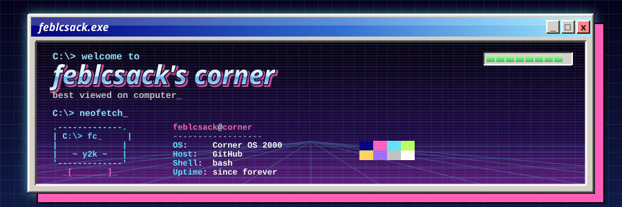
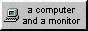
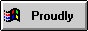
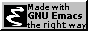
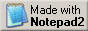

<div align="center">




</div>

<br>

```text
C:\Users\feblcsack> neofetch

 .-------------.    feblcsack@corner
 | C:\> fc_    |    ----------------
 |             |    OS:          Corner OS 2000 (uni edition)
 |   ~ y2k ~   |    Host:        Indonesia
 |             |    Role:        developer + uni student
 '-------------'    Focus:       coding + web design
   _[_______]_      Builds:      apps that actually matter
                                 (industrial safety, AI, web)
                    Likes:       music, movies and books, cats (obviously)
                    Status:      work in progress, check back later :)

                    Listening:   heavy - the marias
                    Playing:     gris
                    Fave song:   dodge this!
                    Fave movie:  se7en
                    Fave animal: geckos
                    Fave food:   naspad, apparently
                    Fave artist: kevin abstract, i think

C:\Users\feblcsack> _
```

<a name="directory"></a>

## `C:\> dir`

⇢ [home](https://github.com/feblcsack)<br>
⇢ [about](#about)<br>
⇢ [projects](#projects)<br>
⇢ [instagram](https://www.instagram.com/feblcsack/)

<a name="whats-new"></a>

## `C:\> type changelog.txt`

```text
[+] built my homepage from scratch!
[+] learned html and css today
[+] more pages coming soon...
```

<a name="about"></a>

## `C:\> type about.txt`

hi! this is my corner of the internet. i made this during my free time at uni, well if u can see this, it means it works.

some things i like:

⇢ coding and web design<br>
⇢ music<br>
⇢ movies and books<br>
⇢ cats (obviously)

<a name="projects"></a>

## `C:\> dir projects`

`<DIR>` **[Chemsafe_AI](https://github.com/feblcsack/Chemsafe_AI)** — finalist project of Intel AI Global Impact Festival<br>
`<DIR>` **[studywarsss](https://github.com/feblcsack/studywarsss)** — use this if u want ur study process feels more like a war to ur friends<br>
`<DIR>` **[Drogue.](https://github.com/feblcsack/Drogue.)** — one-line description here<br>
`<DIR>` **[fiksi-it](https://github.com/feblcsack/fiksi-it)** — one-line description here<br>
`<DIR>` **[LIDM](https://github.com/feblcsack/LIDM)** — one-line description here<br>
`<DIR>` **[nata-jagat](https://github.com/feblcsack/nata-jagat)** — one-line description here

```text
      6 dir(s)    more coming soon!
```

find me on [github](https://github.com/feblcsack?tab=repositories).

<a name="stack"></a>

## `C:\> type stack.txt`

     

<a name="trophy-case"></a>

## `C:\> dir trophies`

⇢ finalist, Intel AI Global Impact Festival (Chemsafe_AI)<br>
⇢ member of [@GarudaHacks](https://github.com/GarudaHacks)

### `holopin badges`

<a href="https://holopin.io/@feblcsack">
  
</a>

<a name="stats"></a>

## `C:\> run stats.exe`

<div align="center">


</div>

<a name="badges"></a>

## `C:\> dir /badges`

<div align="center">











<br>

```text
C:\Users\feblcsack> shutdown /s
  > it is now safe to turn off your computer.
```


</div>
